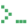
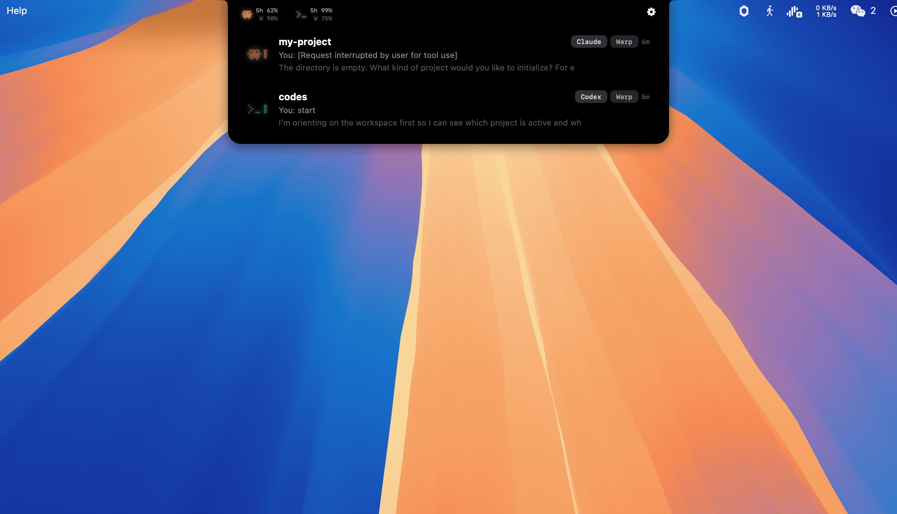
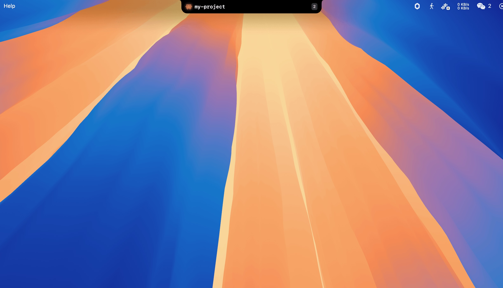
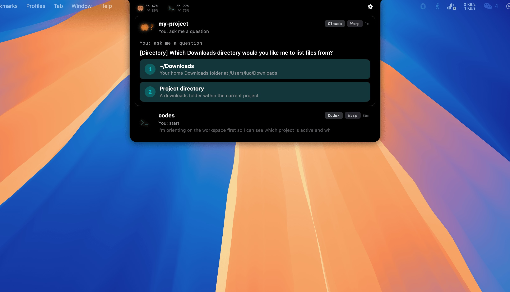
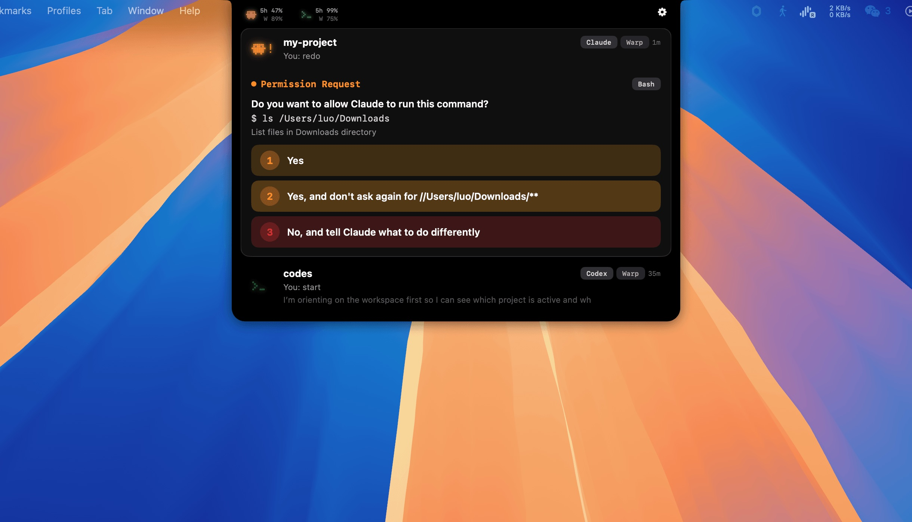

<div align="center">

## Coder Island

&nbsp;&nbsp;

**A macOS notch bar utility that monitors Claude Code and Codex CLI sessions in real-time.**

See what your agents are doing, answer their questions, and track usage — all from the Dynamic Island-style notch area.

</div>



## Features

- **Live Session Monitoring** — See every Claude Code and Codex session running on your machine, with real-time status updates via hooks
- **Permission Routing** — Intercepts permission prompts and shows them in a native banner. Allow, deny, or allow-always without switching to the terminal
- **Question Answering** — When Claude asks a question, see it with clickable options. Answer directly from the UI
- **Usage Tracking** — Monitor your 5-hour and weekly rate limits for both Claude and Codex at a glance
- **Terminal Jump** — Click any session to jump directly to its terminal window (Warp, Ghostty, iTerm2, VS Code, Terminal.app)
- **Sound Notifications** — Customizable sound effects for permissions, questions, and completions (Mario, Pop, Chime presets or custom)
- **Plan Mode Detection** — Shows "Waiting for plan approval" when Claude enters plan mode

### Compact Bar



### Ask Question



### Permission Request



## Install

1. Download `CoderIsland-1.0.0.dmg` from [Releases](https://github.com/luokebi/coder-island/releases)
2. Drag Coder Island to Applications
3. Launch — it appears in the macOS notch area
4. Open Settings and enable "Answer questions & permissions in Coder Island" for hook integration

> Users may need to right-click → Open on first launch to bypass Gatekeeper.

## Requirements

- macOS 14 Sonoma or later

## Build from Source

```bash
# Debug build
xcodebuild -project CoderIsland.xcodeproj -scheme CoderIsland -configuration Debug build

# Package DMG
./scripts/package-dmg.sh
```

## Settings

### Agent Monitoring
- **Claude Code** / **OpenAI Codex CLI** — Toggle which agents to monitor

### Interaction
- **Answer questions & permissions in Coder Island** — Installs hook scripts so permission prompts and questions appear in the app's UI instead of blocking the terminal. Requires restarting active Claude Code sessions after enabling.

### Sound
- **Sound effects** — Toggle audio notifications on/off
- **Sound preset** — Choose from Mario, Pop, or Chime built-in sound profiles
- **Per-event toggles** — Enable/disable sounds individually for permission requests, questions, task completions, and app start
- **Custom sounds** — Import your own audio files for any event

### System
- **Launch at login** — Start Coder Island automatically after login
- **Display** — Choose which screen the notch panel lives on (automatic or manual)
- **Accessibility** — Required for terminal tab switching and foreground app detection. Grant access when prompted.

### Behaviour
- **Smart suppression** — Don't auto-expand the panel when the agent's terminal window is already in focus. Prevents the notch from popping out on top of what you're already looking at.
- **Show usage limits** — Display Claude/Codex usage icons in the expanded panel header
- **Detailed usage display** — Show 5-hour and weekly remaining percentages inline next to the agent icons, not just on hover
- **Hide in fullscreen** — Automatically hide Coder Island when any app enters fullscreen mode

## How It Works

Coder Island discovers sessions by scanning `~/.claude/sessions/` and `~/.codex/sessions/`. When hooks are enabled, it installs lightweight shell scripts that relay Claude Code events to the app via a Unix domain socket — zero latency.

The app lives in the macOS notch area (or menu bar on non-notch Macs). Hover to expand, click a session to jump to its terminal.

## Tech

- Swift & SwiftUI
- Unix Socket IPC
- ~11K lines of code

## License

MIT
